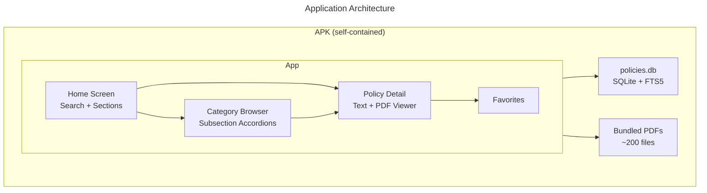

<!-- To use your own logo: replace the SVG files in assets/ or add a logo image to the <picture> sources -->


---

<details>
<summary>Table of Contents</summary>

- [For EMS Crews](#for-ems-crews)
- [Features](#features)
- [For Developers & Administrators](#for-developers--administrators)
- [Architecture](#architecture)
- [Tech Stack](#tech-stack)
- [Project Structure](#project-structure)
- [License](#license)

</details>

## For EMS Crews

> [!IMPORTANT]
> Requires an Android phone. Get the `.apk` file from your crew chief or administrator before starting.

1. On your Android device: **Settings → Security** → enable "Install from unknown sources" (or grant permission to your file manager when prompted)
2. Open the `.apk` file and tap **Install**
3. Open **NCE Field Guide** — all 200+ policies work offline immediately

No account. No login. No internet required after install.

## Features

- **Full offline access** — all ~200 policy PDFs bundled inside the APK; zero network calls after install
- **Full-text search** — SQLite FTS5 with porter stemming across titles, clinical keywords, and policy text; fuzzy prefix matching ("card" → "cardiac")
- **Browse by category** — policies organized by section with collapsible subsection accordions
- **PDF viewer** — tap any policy to read the original PDF inline
- **Favorites** — save frequently referenced policies for instant access
- **Dark/light theme** — adapts to system preference
- **Provider-level tags** — policies tagged by ALS/BLS applicability

## For Developers & Administrators

### Prerequisites

<table>
  <tr><th>Dependency</th><th>Version</th><th>Notes</th></tr>
  <tr><td>Node.js</td><td>18+</td><td><a href="https://nodejs.org">nodejs.org</a></td></tr>
  <tr><td>Java JDK</td><td>17</td><td>Required for Android builds</td></tr>
  <tr><td>Android SDK</td><td>Platform 34, Build Tools 34.0.0, NDK</td><td>Via <a href="https://developer.android.com/studio">Android Studio</a> or standalone tools; set <code>ANDROID_HOME</code></td></tr>
  <tr><td>Python 3</td><td>Any</td><td>Optional — only needed if modifying pipeline scripts</td></tr>
</table>

### First-Time Setup

```bash
# Clone the repo
git clone https://github.com/ConsultingFuture4200/norcal-ems-policies.git
cd norcal-ems-policies

# Install React Native dependencies
npm install

# Install pipeline dependencies
cd scripts && npm install && cd ..
```

### Build the Policy Database

This scrapes norcalems.org, downloads all PDFs, extracts text, generates metadata, and builds the SQLite database bundled into the app.

```bash
cd scripts
node pipeline.js
```

> [!NOTE]
> This takes 5–15 minutes depending on your internet speed. You only need to re-run it when Nor-Cal EMS publishes updated policies.

**What the pipeline does:**

1. Scrapes 6 policy index pages → collects all PDF links
2. Downloads ~200 PDFs to `scripts/output/pdfs/`
3. Extracts text from each PDF
4. Generates clinical keywords and provider-level tags
5. Builds `policies.db` (SQLite with FTS5) and copies everything to `android/app/src/main/assets/`

### Build the APK

```bash
# Debug build (for testing)
cd android && ./gradlew assembleDebug

# Release build (for distribution)
./gradlew assembleRelease
```

| Build | Output Path |
|-------|-------------|
| Debug | `android/app/build/outputs/apk/debug/app-debug.apk` |
| Release | `android/app/build/outputs/apk/release/app-release.apk` |

### Signing for Distribution

> [!IMPORTANT]
> Generate your keystore once and store it securely. Losing it means you cannot update the app for existing installs.

```bash
# Generate a keystore (one-time setup)
keytool -genkeypair -v \
  -storetype PKCS12 \
  -keystore norcal-ems-release.keystore \
  -alias norcal-ems \
  -keyalg RSA -keysize 2048 -validity 10000 \
  -storepass YOUR_PASSWORD -keypass YOUR_PASSWORD \
  -dname "CN=Nor-Cal EMS, O=Nor-Cal EMS, L=CA, ST=California, C=US"
```

Then add signing config to `android/app/build.gradle`:

```groovy
android {
    signingConfigs {
        release {
            storeFile file('norcal-ems-release.keystore')
            storePassword 'YOUR_PASSWORD'
            keyAlias 'norcal-ems'
            keyPassword 'YOUR_PASSWORD'
        }
    }
    buildTypes {
        release {
            signingConfig signingConfigs.release
            minifyEnabled true
            proguardFiles getDefaultProguardFile('proguard-android-optimize.txt'), 'proguard-rules.pro'
        }
    }
}
```

### Updating Policies

When Nor-Cal EMS publishes updated policies:

```bash
# 1. Rebuild the database
cd scripts && node pipeline.js

# 2. Bump version in android/app/build.gradle (versionCode + versionName)

# 3. Build and distribute
cd android && ./gradlew assembleRelease
```

---

## Architecture



**Search:** SQLite FTS5 with porter stemming. Fuzzy prefix matching ("card" → "cardiac") across titles, clinical keywords, and full policy text.

**Offline:** All assets ship inside the APK. No network calls, no first-launch download. Install and go immediately.

---

## Tech Stack


| Component | Library |
|-----------|---------|
| Framework | React Native 0.73 (bare workflow) |
| Navigation | React Navigation 6 |
| Database | op-sqlite (SQLite with FTS5) |
| PDF Viewer | react-native-pdf |
| File System | react-native-blob-util |
| Icons | react-native-vector-icons (MaterialCommunityIcons) |

---

## Project Structure

```
norcal-ems-policies/
├── scripts/                    # Build-time data pipeline
│   ├── pipeline.js             # Master pipeline — run this to rebuild data
│   ├── scrape-policies.js      # Step 1: Scrape norcalems.org
│   ├── download-pdfs.js        # Step 2: Download PDFs
│   ├── extract-text.js         # Step 3: Extract text from PDFs
│   ├── generate-metadata.js    # Step 4: Keywords + provider-level tags
│   └── build-sqlite.js         # Step 5: Build SQLite + copy to assets
├── src/
│   ├── App.tsx                 # Entry point with database init
│   ├── navigation/             # React Navigation setup
│   ├── screens/                # Home, Browse, Favorites, Detail
│   ├── components/             # Reusable UI components
│   ├── database/               # SQLite queries and TypeScript types
│   ├── hooks/                  # Search, favorites, filter hooks
│   ├── theme/                  # Dark/light theme, typography, spacing
│   └── utils/                  # Helpers (highlighting, PDF paths)
├── android/                    # Android native project
│   └── app/src/main/assets/    # policies.db + pdfs/ (pipeline-generated)
└── assets/
    ├── banner-light.svg
    └── banner-dark.svg
```

---

## License

The policy documents are published by [Nor-Cal EMS](https://www.norcalems.org) and are freely available for reference use. This application is an unofficial field reference tool for EMS providers and is not affiliated with or endorsed by Nor-Cal EMS.
